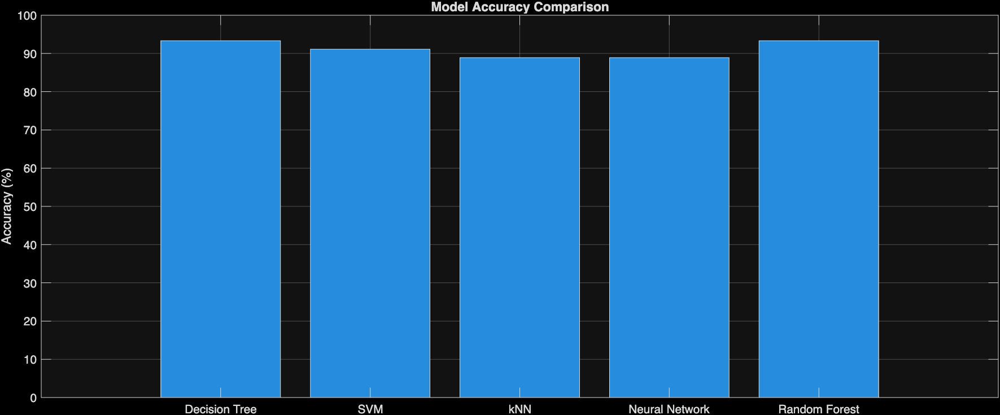
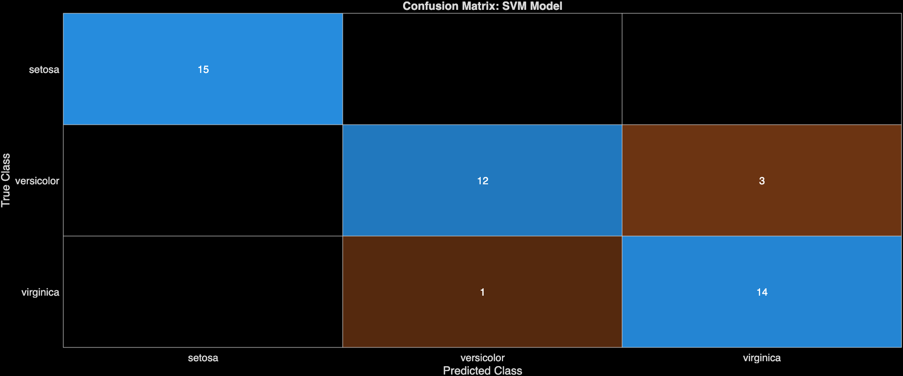
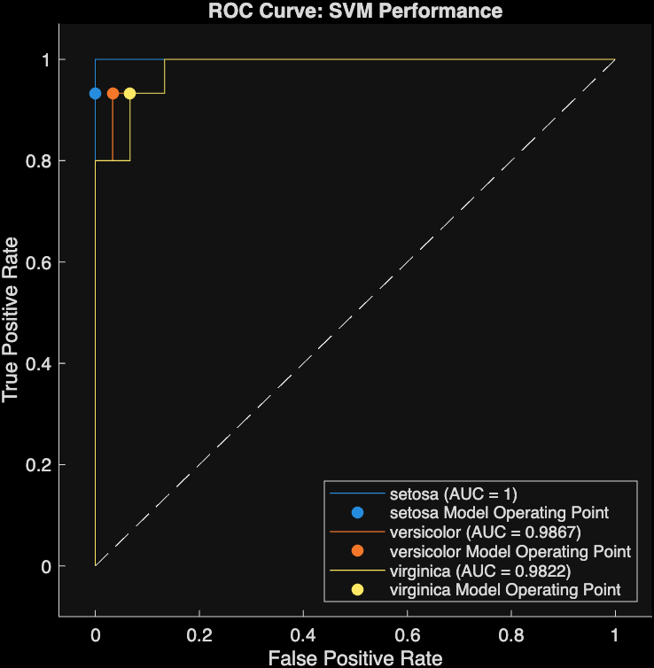

# MATLAB Machine Learning Mini Project: Iris Flower Classification

This repository contains a MATLAB project that demonstrates the implementation and comparison of various machine learning classification models on the classic Iris flower dataset. The project aims to provide a clear, beginner-friendly example for those new to machine learning in MATLAB, suitable for inclusion in a GitHub portfolio.

## Models Implemented

The project trains and evaluates the following classification algorithms:

*   **Decision Tree**
*   **Support Vector Machine (SVM)**
*   **k-Nearest Neighbors (kNN)**
*   **Neural Network**

## Evaluation Metrics & Visualizations

For each model, the following are calculated and visualized:

*   **Accuracy**: The proportion of correctly classified instances.
*   **Confusion Matrix**: A table that describes the performance of a classification model on a set of test data for which the true values are known.
*   **Receiver Operating Characteristic (ROC) Curve**: A plot that illustrates the diagnostic ability of a binary classifier system as its discrimination threshold is varied. For multiclass problems, it's typically plotted for each class against the rest.

## Dataset

The project uses the built-in `fisheriris` dataset in MATLAB, which contains measurements for 150 iris flowers from three different species: *Iris setosa*, *Iris versicolor*, and *Iris virginica*. Each species has 50 samples, with four features measured from each sample: the length and the width of the sepals and petals.

## Getting Started

### Prerequisites

To run this project, you will need:

*   MATLAB (R2018b or newer is recommended)
*   Statistics and Machine Learning Toolbox
*   Deep Learning Toolbox (for Neural Network functionality)

### Installation

1.  **Clone the repository:**
    ```bash
    git clone https://github.com/06-nitiin/Matlab-ML-project.git
    cd Matlab-ML-project
    ```
2.  **Open MATLAB:** Launch your MATLAB application.
3.  **Navigate to the project directory:** In MATLAB, use the "Current Folder" browser to navigate to the `Matlab-ML-project` directory where you cloned the repository.

### Running the Project

1.  **Open `main.m`:** Double-click on `main.m` in the MATLAB Current Folder browser to open it in the editor.
2.  **Run the script:** Click the "Run" button in the MATLAB editor, or type `main` in the MATLAB Command Window and press Enter.

The script will execute, and you will see output in the Command Window regarding the training process and accuracies. Several figures will be generated, displaying the accuracy bar chart, confusion matrices for each model, and ROC curves.

## Project Structure

```
Matlab-ML-project/
├── main.m                % Main script to run the classification and analysis
└── README.md             % Project description and instructions
```

## Results

Upon running `main.m`, you will observe:

*   A bar chart comparing the accuracy of all four models.
*   Individual confusion matrix plots for Decision Tree, SVM, kNN, and Neural Network.
*   ROC curves for each model, illustrating their performance across different classification thresholds.

## Results & Visualizations

### Model Accuracy Comparison


### Confusion Matrix (SVM)


### ROC Curve



## Contributing

Feel free to fork this repository, make improvements, and submit pull requests. Any suggestions or enhancements are welcome!

## License

This project is open-source and available under the MIT License.

## Contact

For any questions or feedback, please open an issue in this repository.
